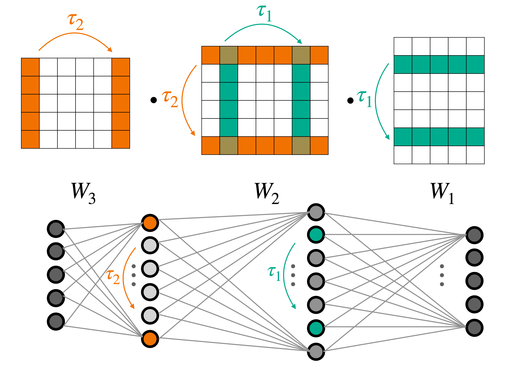

# DWSNets

Official implementation for [_Equivariant Architectures for Learning in Deep Weight Spaces_](https://arxiv.org/abs/2301.12780) by Aviv Navon, Aviv Shamsian, Idan Achituve, Ethan Fetaya, Gal Chechik, Haggai Maron.



Our implementation follows the block structure as describe in the paper.


## Experiment

To run the experiments, first create clean virtual environment and install the requirements. 
We recommend first installing Pytorch following this link: [Start Locally - PyTorch](https://pytorch.org/get-started/locally/). 
Next install additional requirements using: ```pip install -e .```.

To run specific experiment, please follow the instructions in the README file within each experiment folder. 
It provides full instructions and details for downloading the data and reproducing the results reported in the paper.

