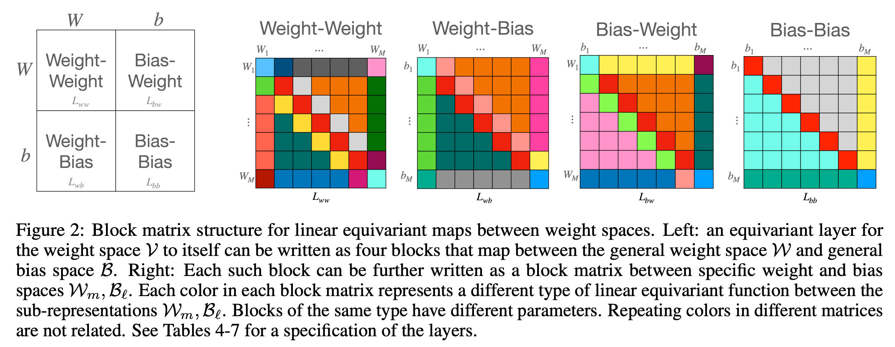

# DWSNets

Official implementation for [_Equivariant Architectures for Learning in Deep Weight Spaces_](https://arxiv.org/abs/2301.12780) by Aviv Navon, Aviv Shamsian, Idan Achituve, Ethan Fetaya, Gal Chechik, Haggai Maron.
<p align="center"> 
    
</p>

Our implementation follows the block structure as described in the paper.



## Setup environment

To run the experiments, first create clean virtual environment and install the requirements.

```bash
conda create -n dwsnets python=3.9
conda activate dwsnets
conda install pytorch==1.12.1 torchvision==0.13.1 torchaudio==0.12.1 cudatoolkit=11.3 -c pytorch
```

Install the repo:

```bash
git clone https://github.com/AvivNavon/DWSNets.git
cd DWSNets
pip install -e .
```

## Introduction Notebook
An introduction notebook for INR classification with DWSNets: 
[](https://colab.research.google.com/github/AvivNavon/DWSNets/blob/main/notebooks/mnist-inr-classification.ipynb)

## Run experiment

To run specific experiment, please follow the instructions in the README file within each experiment folder. 
It provides full instructions and details for downloading the data and reproducing the results reported in the paper.
### Dataset 
**The datasets are available [here](https://www.dropbox.com/sh/56pakaxe58z29mq/AABtWNkRYroLYe_cE3c90DXVa?dl=0).**
- [Sine regression INRs](https://www.dropbox.com/sh/56pakaxe58z29mq/AABtWNkRYroLYe_cE3c90DXVa?dl=0&preview=sine-regression-inrs.zip)
- [MNIST INRs](https://www.dropbox.com/sh/56pakaxe58z29mq/AABtWNkRYroLYe_cE3c90DXVa?dl=0&preview=mnist-inrs.zip)
- [SSL INRs](https://www.dropbox.com/sh/56pakaxe58z29mq/AABtWNkRYroLYe_cE3c90DXVa?dl=0&preview=ssl-inrs.zip)

## Citation

If you find our work or this code to be useful in your own research, please consider citing the following paper:

```bib
@article{
    navon2023equivariant,
    title={Equivariant Architectures for Learning in Deep Weight Spaces},
    author={
        Navon, Aviv and Shamsian, Aviv and Achituve, Idan and Fetaya, 
        Ethan and Chechik, Gal and Maron, Haggai
    },
    journal={arXiv preprint arXiv:2301.12780},
    year={2023}
}
```
